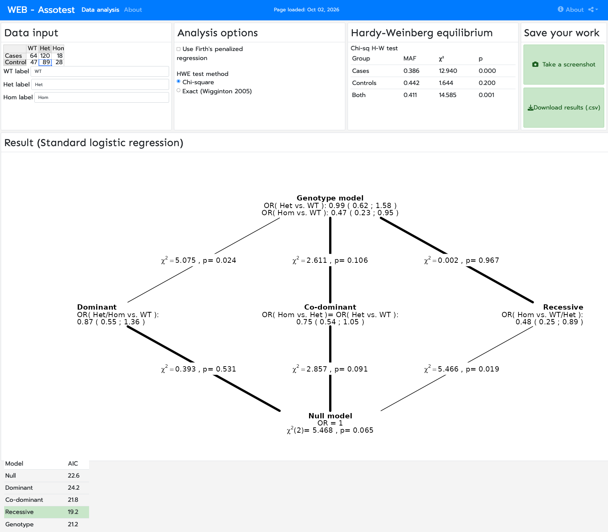

# Summary

`Web-Assotest` is a browser-based tool for analysing the association between a genetic
variant and a binary outcome (cases vs. controls) from a 3x2 table of observed genotype
counts (wild-type / heterozygote / homozygote, by case/control status).

The tool simultaneously fits a hierarchy of five nested
logistic-regression models --— null, dominant, co-dominant (additive),
recessive, and genotypic --— and presents the resulting odds ratios, 95%
confidence intervals, likelihood-ratio test statistics, and AIC values
in a single model-comparison diagram, together with a Hardy-Weinberg
equilibrium (HWE) check for cases, controls, and the combined sample
[@wigginton2005note]. Users can optionally fit the same model
hierarchy with Firth's penalized logistic regression [@firth1993bias;
@ploner2023logistf] to obtain stable estimates when a genotype count
is zero or the data are otherwise separated.

`Web-Assotest` is implemented in R as a single `flexdashboard`/Shiny
application [@rcoreteam2024; @chang2024shiny;
@iannone2024flexdashboard], runs entirely in the browser once
deployed, and requires no local software installation, scripting, or
statistical training beyond entering the genotype counts into an
editable table.

Non-R-savvy users who do not want to run the application locally can run the application directly in a browser from this URL 
`http://ekstroem.com:3838/webassotest/`.

# Statement of need

Testing whether a genetic variant is associated with a disease or
trait from a simple genotype-by-outcome count table is one of the most
common analyses in applied genetic epidemiology, and it is one that
many applied researchers (clinicians, wet-lab biologists, or students)
need to perform without necessarily writing R or Python code
themselves.

The statistical subtlety is that "the" genetic effect is not a single
quantity: the same data can be tested under a dominant, recessive,
co-dominant, or fully genotypic model, and these choices are not
interchangeable. A variant that shows a strong dominant effect can
show a null recessive effect, and vice versa.

Existing options for
this analysis are either large, general-purpose genetics toolchains
aimed at genome-wide data (e.g. PLINK) that are overkill and require
command-line fluency for a single 3x2 table, or R packages such as
`SNPassoc` that require the user to already be working in
R. `Web-Assotest` fills the gap between these: a lightweight,
model-comprehensive, point-and-click tool for the single-marker case,
so that the choice of genetic model is made visible and testable
rather than assumed. The exact HWE test of @wigginton2005note is
bundled so that genotyping-quality checks and the association test
itself are available in one place. The tool has been used as teaching
material for case-control study design and has been applied in the
author's own applied genetics research (see Research impact statement
below).

# State of the field

TODO: expand with a short, referenced comparison to alternative tools users might reach
for instead of `Web-Assotest`, for example:

- Command-line/whole-genome toolchains (e.g. PLINK) — powerful for genome-wide data but
  require installation and scripting for a single marker.
- R packages for candidate-gene association (e.g. `SNPassoc`, `genetics`) — flexible but
  require R programming and are not accessible to non-programming collaborators.
- Standalone HWE calculators (e.g. the Court Lab HWE calculator) — cover HWE testing only,
  not the genetic-model comparison this tool provides.

`Web-Assotest` differs from all of the above by combining (a) a no-install, browser-based
interface, (b) simultaneous fitting and visual comparison of all standard genetic models
rather than a single pre-chosen contrast, and (c) an integrated HWE check, in one small
single-file application.

# Software design

`Web-Assotest` is implemented as a single R Markdown file (`webassotest.Rmd`) built with
`flexdashboard` and running as a Shiny application (`runtime: shiny`), so there is no
separate `ui.R`/`server.R` split.

The reactive pipeline reads the user's edits to a
$3\times2$ `rhandsontable` genotype-count table, rounds and validates them, and re-fits all five
nested models (`nul`, `gen`, `dom`, `cod`, `rec`) on every change via the function `gtm()`. The application then draws
the model-comparison diagram with base R graphics and returns a tidy summary data frame
used for both the on-screen Akaike information criterion (AIC) table and CSV export. Likelihood-ratio tests use
`anova(..., test = "Chisq")` under standard logistic regression, or a manual deviance
difference under Firth's penalized regression [@firth1993bias] via the `logistf` package
[@ploner2023logistf]; the latter is offered as a toggle so that zero-cell/separated
genotype counts do not require the Fisher's-exact-test fallback used in the standard
mode. HWE testing (`SNPHWE()`) implements the exact test of @wigginton2005note directly
in R rather than depending on an external genetics package, keeping the application to a
single deployable file with a small dependency footprint
(`flexdashboard`, `rhandsontable`, `shinyscreenshot`, `logistf`).

# Research impact statement

`Web-Assotest` (and its predecessor) has been used in published
candidate-gene case-control studies spanning more than two decades
(2004–2025) and a broad range of research groups and populations,
including Danish, Polish, Iranian, Japanese, Iraqi, and Indian
cohorts. The applications cover a wide range of phenotypes and publications, some of which are listed below:

- **Type 2 diabetes and its complications**, including diabetic
  retinopathy and diabetic foot [@hansen2004large;
  @hansen2005variation; @keshavarz2006no; @mrozikiewicz2017role;
  @gohari2020single].
- **Obesity, adipokines, and ageing** [@roszkowska2012total;
  @al2019fto].
- **Cardiovascular disease**, including essential hypertension and
  acute coronary syndrome [@wrzosek2015impact; @gutowska2025advanced].
- **Psychiatric and behavioural phenotypes**, including completed
  suicide, opioid dependence, and paraphilic sexual offending
  [@chojnicka2012analysis; @chojnicka2013possible;
  @chojnicka2014inverse; @fudalej2016disc1; @jakubczyk2017paraphilic].
- **Neurodegenerative disease** (late-onset Alzheimer's disease)
  [@fatemi2023tbx21].
- **Autoimmune disease** (Graves' disease) [@kurylowicz2007association].
- **Ophthalmology** (Fuchs endothelial corneal dystrophy)
  [@oldak2015fuchs].
- **Gastrointestinal disease** (colonic diverticulosis)
  [@nehring2023genetic].
- **Reproductive health** (recurrent miscarriage)
  [@sudhir2016association].

This breadth illustrates that the tool meets a recurring need in
applied genetic epidemiology across clinical specialties: a quick,
transparent comparison of genetic inheritance models for a single
marker, performed by researchers who are not necessarily
statistical programmers.

# AI usage disclosure

AI has been used to correct this manuscript for spelling and Claude
Code was used to assemble the initial list of papers citing
Web-Assotest. The list has subsequently been manually curated.  The
core part of the `webassotest.Rmd` application predates AI tools and
has not been. Claude Code has been used to update and improve the
flexdashboard layout and has been used to optimize the load speed of
the reactive expressions in the application.

# Acknowledgements

I am grateful to Bendix Carstensen who helped form an initial version
of the assotest programme. I am also grateful to the users who have provided
encouragement throughout the year to make sure that the application
was kept availale as an online application and continually developed.

# References
